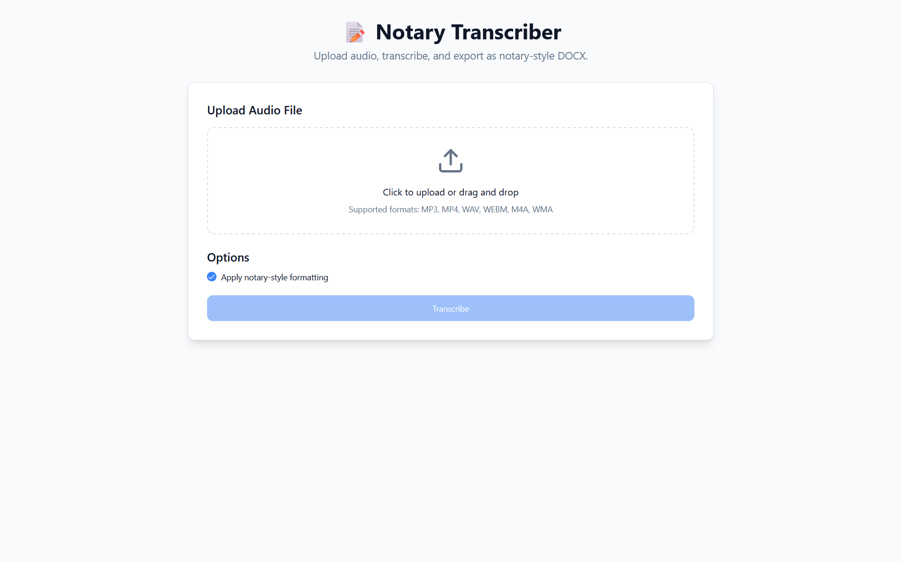
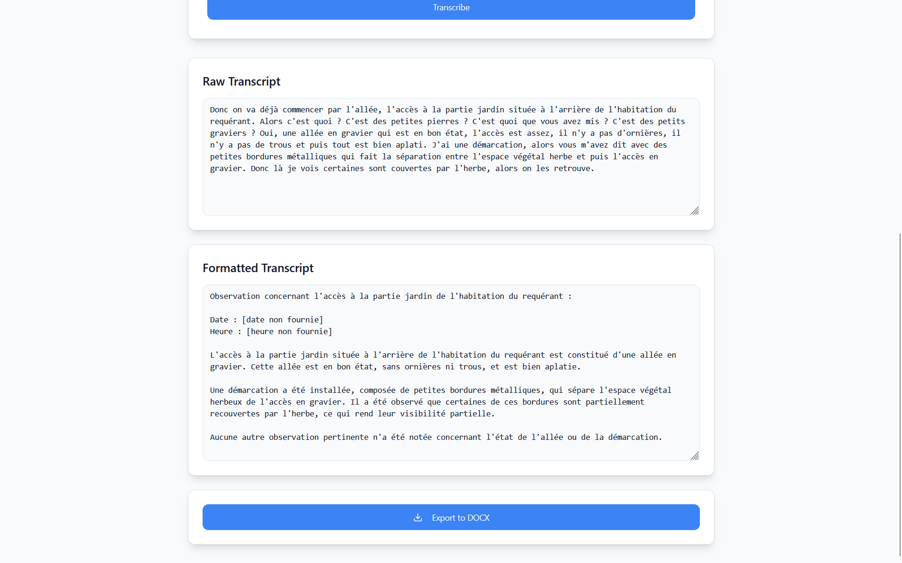

# Attorney AI Assistant: An Audio Transcription Tool for Attorneys and Notaries

**Attorney AI Assistant** is a multilingual audio-to-text tool designed to help attorneys and notaries quickly turn recorded statements into clear, structured reports. It supports common mobile-recorded audio formats and produces clean, professionally formatted text suitable for legal documentation.

The project was developed in collaboration with notary professionals who needed a fast, reliable way to transcribe on-the-go audio—typically captured on a phone—without sacrificing accuracy or confidentiality.

For ease of use, this repository integrates with LLM API providers (Mistral and OpenAI supported). However, the intended deployment is fully self-hosted, running locally with open-source models such as Voxtral and Mistral to ensure complete data privacy for legal practitioners.

## Features

- Formats transcribed text into a professional document, in notary tone and format.
- Export result to `.docx`.
- Supports multiple audio formats: .mp3, .mp4, .mpeg, .mpga, .m4a, .wav, .webm
- Supports 2 languages: English and French.
- Support both Mistral and OpenAI APIs.

## Dev Setup

### Prerequisites

- **Python 3.8+** (for backend)
- **Node.js 18+** and **npm** (for frontend)
- **ffmpeg** (only needed for audio format conversion; if not installed, use only .mp3 files)
  - Download from [ffmpeg.org](https://ffmpeg.org/download.html)
  - Ensure `ffmpeg` is available in your system PATH

### Environment Configuration

Create a `.env` file at the root of the repository with the following variables:

```env
# Required: Choose one AI provider (default is set to Mistral, but you still need an API key)
MISTRAL_API_KEY=your_mistral_api_key_here
PROVIDER=mistral
# OR
OPENAI_API_KEY=your_openai_api_key_here
PROVIDER=openai

# Optional: Configure CORS origins to allow the front-end service to communicate with the back-end service. By default, FE is running on port 5173.
ALLOWED_ORIGINS=http://localhost:5173

# Optional: Set log level (DEBUG, INFO, WARNING, ERROR)
LOG_LEVEL=INFO
```

**Note:** You only need to provide one API key depending on which provider you want to use. The provider is selected in `backend/app/services/transcription.py` and `backend/app/services/formatting.py` via the `PROVIDER` constant.

### Installation

Install all dependencies and set up a back-end virtual environment:

```bash
make install
```

### Running Tests

Run the backend unit tests:

```bash
make test
```

### Running the Application

Start both the backend and frontend servers:

```bash
make run
```

This will open two separate terminal windows:
1. **Backend** (Port 8000): FastAPI server with detailed logging
2. **Frontend** (Port 5173): React development server with hot-reload

Once both servers are running, access the app at http://localhost:5173 on your favorite browser. You can use audio files provided in directory `demo_audio`.

### Individual Server Commands

You can also run servers individually:

```bash
# Backend only
make run-backend

# Frontend only (requires manual setup)
cd frontend
npm run dev
```


## Architecture

The application follows a client-server architecture with a React frontend and a FastAPI backend.

### System Overview

```
┌─────────────┐         ┌──────────────┐         ┌─────────────┐
│   Frontend  │────────▶│   Backend    │────────▶│  AI APIs    │
│  (React)    │  HTTP   │  (FastAPI)   │  API    │ (Mistral/   │
│             │◀────────│              │◀────────│  OpenAI)    │
└─────────────┘         └──────────────┘         └─────────────┘
     Port 5173              Port 8000
```

### Backend Architecture

The backend is organized into modular components:

#### **Routers** (`backend/app/routers/`)
- **`transcribe.py`**: Handles audio file uploads and transcription requests
  - Accepts audio files in multiple formats
  - Converts unsupported formats to MP3 using ffmpeg
  - Returns raw and optionally formatted transcripts
- **`export.py`**: Converts formatted transcripts to DOCX format
- **`health.py`**: Health check endpoint for monitoring

#### **Services** (`backend/app/services/`)
- **`transcription.py`**: Core transcription logic with provider abstraction
  - Supports both Mistral (voxtral-mini-latest) and OpenAI (whisper-1)
  - Provider selection via `PROVIDER` constant
- **`formatting.py`**: Formats raw transcripts into professional notary-style documents
  - Uses LLM (Mistral medium or GPT-4o-mini) to clean and format text
  - Applies notary-specific formatting rules
- **`audio_convert.py`**: Audio format conversion utility
  - Converts unsupported formats to MP3 using ffmpeg
  - Validates audio format compatibility
- **`exporter.py`**: DOCX export functionality
  - Converts markdown/formatted text to DOCX using python-docx
  - Preserves formatting (headings, lists, bold, italic)

#### **Clients** (`backend/app/clients/`)
- **`openai_client.py`**: OpenAI API client wrapper
- **`mistral_client.py`**: Mistral API client wrapper
- Both clients read API keys from environment variables

#### **Configuration** (`backend/app/config.py`)
- Centralized settings management
- Environment variable handling via `python-dotenv`
- Configurable CORS origins, log levels, and API keys

### Frontend Architecture

The frontend (`frontend/`) is a React application built with:
- **Vite**: Build tool and dev server
- **React Router**: Client-side routing
- **TanStack Query**: Data fetching and state management
- **shadcn/ui**: UI component library
- **Tailwind CSS**: Styling

#### Key Components
- **`Index.tsx`**: Main transcription interface
  - File upload with drag-and-drop support
  - Audio preview
  - Transcription status and results display
  - Export functionality

### Data Flow

1. **Upload**: User uploads audio file via frontend
2. **Conversion**: Backend converts to MP3 if needed (using ffmpeg)
3. **Transcription**: Audio sent to AI provider (Mistral/OpenAI) for speech-to-text
4. **Formatting** (optional): Raw transcript sent to LLM for professional formatting
5. **Export**: Formatted text converted to DOCX and downloaded

### Technology Stack

**Backend:**
- FastAPI (Python web framework)
- OpenAI SDK / Mistral SDK (AI transcription)
- python-docx (DOCX generation)
- ffmpeg (audio conversion)
- pytest (testing)

**Frontend:**
- React 18
- TypeScript
- Vite
- TanStack Query
- shadcn/ui components
- Tailwind CSS

## UI Showcase



